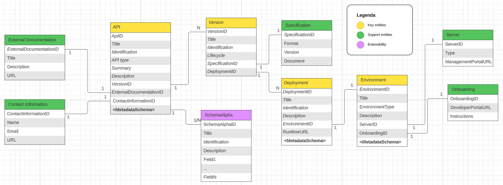
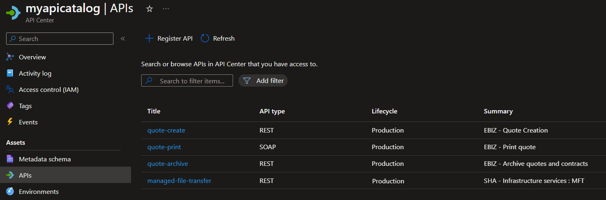
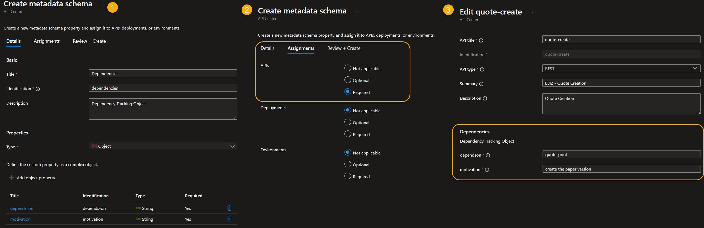
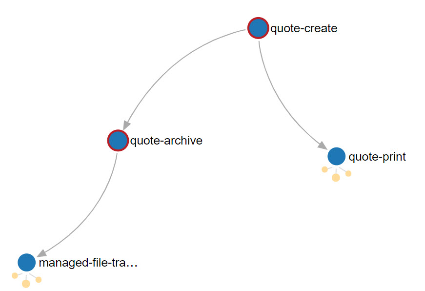

# azure-api-center-firstlook
Azure API Center resources

# Pseudo-ER



# Dependency tracker

Create a APIs and new metadata





APIs become a VERTEX and properties are attached to the vertex

```
g.addV('quote-create').property('id', 'quote-create').property('type', 'REST').property('lifecycle', 'Production').property('version', '123').property('endpoint', 'External')
g.addV('quote-print').property('id', 'quote-print').property('type', 'SOAP').property('lifecycle', 'Production').property('version', '346').property('endpoint', 'Internal')
g.addV('quote-archive').property('id', 'quote-archive').property('type', 'REST').property('lifecycle', 'Production').property('version', '366').property('endpoint', 'Internal')
g.addV('managed-file-transfer').property('id', 'managed-file-transfer').property('type', 'REST').property('lifecycle', 'Production').property('version', '401').property('endpoint', 'Internal')
```

Process the dependencies object to create the depends_on EDGES. The motivation field is added as edge property.

```
g.V().hasLabel('quote-create').has('version', '123').addE('depends_on')
    .to(g.V().hasLabel('quote-print').has('version', '346')).property('motivation','create the paper version')
g.V().hasLabel('quote-create').has('version', '123').addE('depends_on')
    .to(g.V().hasLabel('quote-archive').has('version', '366')).property('motivation','archive the contact')
g.V().hasLabel('quote-archive').has('version', '366').addE('depends_on')
    .to(g.V().hasLabel('managed-file-transfer').has('version', '401')).property('motivation','move files to archive')
```

plot the graph



# API Design Workflow


